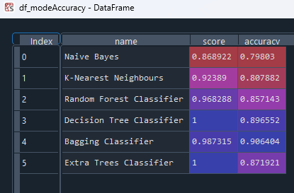

# ML Classification Project

This repository contains a machine learning project that focuses on classification using various models and evaluating their performance. The project includes data preprocessing, model training, and accuracy assessment.

## Dataset

The project uses a dataset from 'crxdataReducedClean.csv', which is preprocessed to make it suitable for classification tasks.

## Models

The following classification models are used in this project:

- Naive Bayes
- K-Nearest Neighbours
- Random Forest Classifier
- Decision Tree Classifier
- Bagging Classifier
- Extra Trees Classifier

Each model is trained on the dataset, and the model's score and accuracy on the test data are evaluated.

## Results

